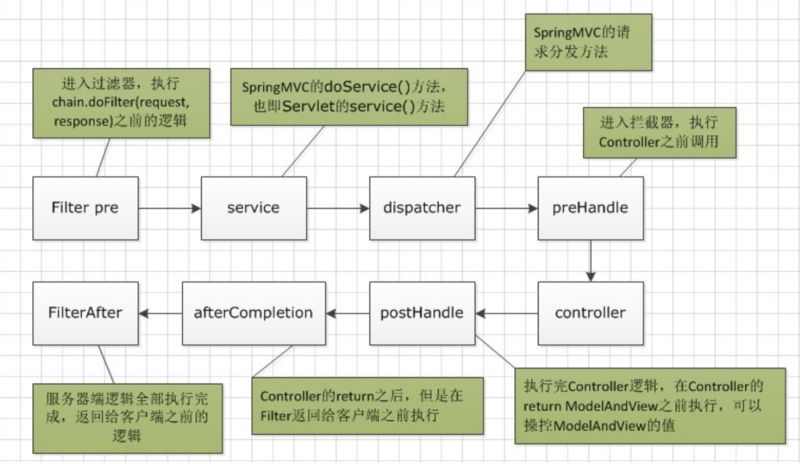

## Spring Boot 演示之 Web 相关

#### 说明
>演示servlet、filter、interceptor

#### 环境
>1. jdk1.8 
>2. spring boot 1.5.8.RELEASE

#### 实践的思考
>过滤器和拦截器非常相似，但是它们有很大的区别:
>1. 过滤器可以修改request，而拦截器不能
>2. 过滤器需要在servlet容器中实现，拦截器可以适用于javaEE，javaSE等各种环境
>3. 拦截器可以调用IOC容器中的各种依赖，而过滤器不能
>4. 过滤器只能在请求的前后使用，而拦截器可以详细到每个方法
>
>总的来说,过滤器就是筛选出你要的东西，比如requeset中你要的那部分。拦截器在做安全方面用的比较多，比如终止一些流程。

>